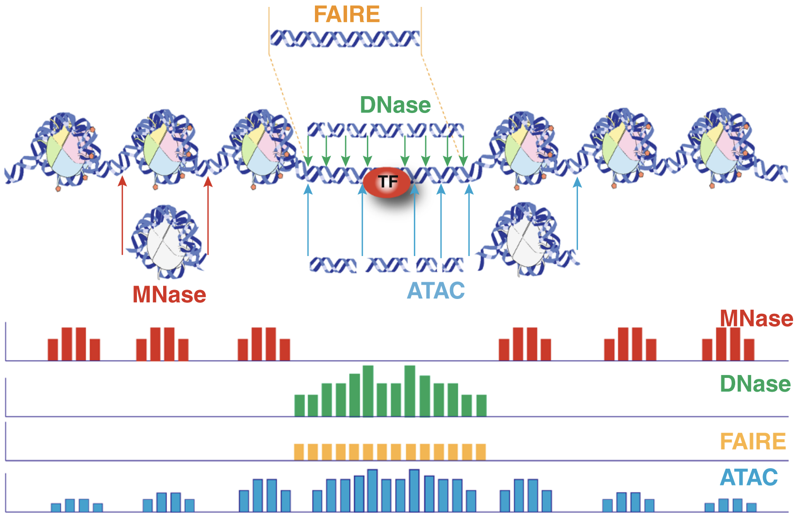
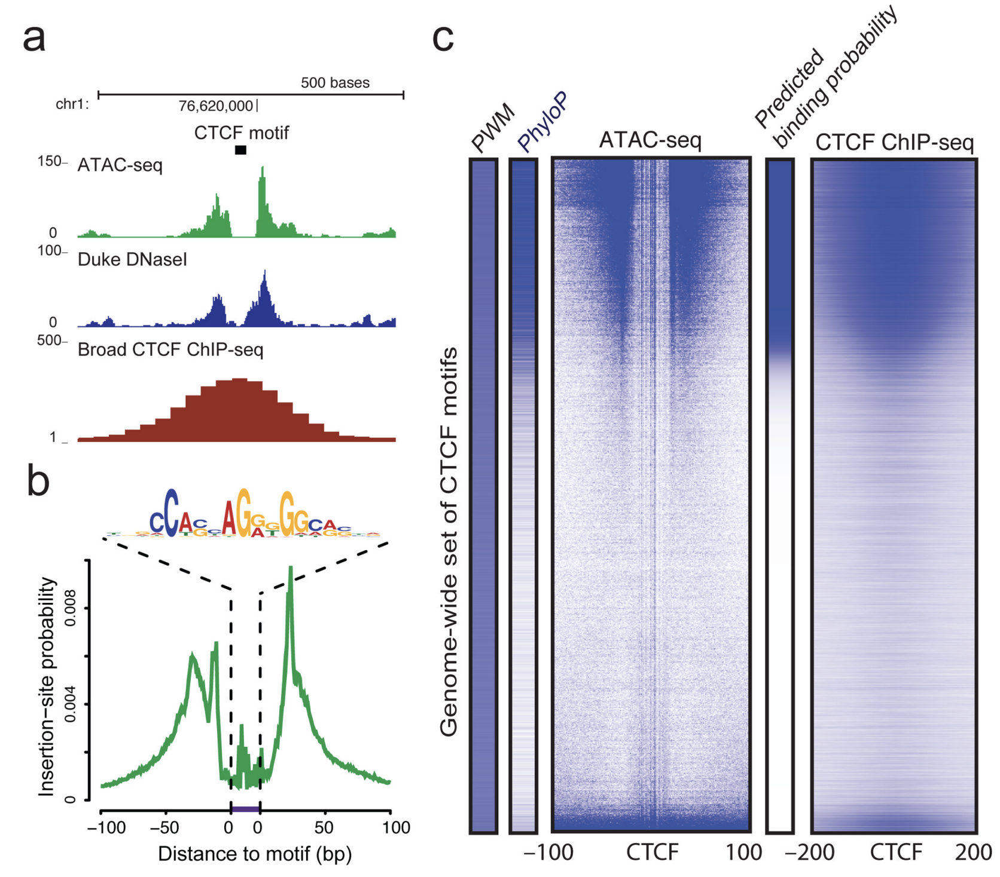
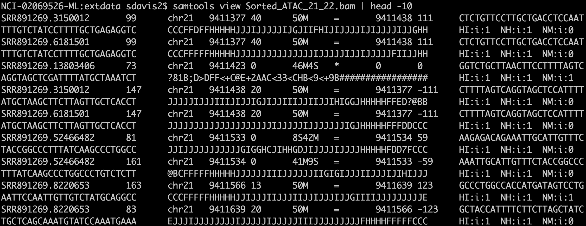

```{r include=FALSE}
library(knitr)
library(BiocStyle)
opts_chunk$set(cache=TRUE, message=FALSE, warning=FALSE)
```

# Background

Chromatin accessibility assays measure the extent to which DNA is open and accessible.
Such assays now use high throughput sequencing as a quantitative readout. DNAse assays, first using microarrays[@Crawford2006-nt] and then DNAse-Seq [@Crawford2006-bk], requires a larger amount of DNA and is labor-indensive and has been largely supplanted by ATAC-Seq [@Buenrostro2013-dz]. 

The Assay for Transposase Accessible Chromatin with high-throughput sequencing (ATAC-seq) method maps chromatin accessibility genome-wide. This method quantifies DNA accessibility with a hyperactive Tn5 transposase that cuts and inserts sequencing adapters into regions of chromatin that are accessible. High throughput sequencing of fragments produced by the process map to regions of increased accessibility, transcription factor binding sites, and nucleosome positioning. The method is both fast and sensitive and can be used as a replacement for DNAse _and_ MNase. A schematic of the protocol is given in Figure \@ref(fig:protocol).

```{r protocol, echo=FALSE, fig.cap = "Schematic overview of ATAC-Seq protocol. Figure from Wikipedia."}
knitr::include_graphics("https://upload.wikimedia.org/wikipedia/commons/thumb/d/d9/ATAC-Seq_Fig.1.pdf/page1-984px-ATAC-Seq_Fig.1.pdf.jpg")
```

An early review of chromatin accessibility assays [@Tsompana2014-yh] compares the use cases, pros and cons, and expected signals from each of the most common approaches (Figure \@ref(fig:chromatinAssays)).

```{r chromatinAssays, echo=FALSE, fig.cap="Chromatin accessibility methods, compared. Representative DNA fragments generated by each assay are shown, with end locations within chromatin defined by colored arrows. Bar diagrams represent data signal obtained from each assay across the entire region. The footprint created by a transcription factor (TF) is shown for ATAC-seq and DNase-seq experiments."}

```

The first manuscript describing ATAC-Seq protocol and findings outlined how ATAC-Seq data "line up" with other datatypes such as ChIP-seq and DNAse-seq (Figure \@ref(fig:greenleaf)). They also highlight how fragment length correlates with specific genomic regions and characteristics [@Buenrostro2013-dz, Figure 3].

```{r greenleaf, echo=FALSE, fig.cap='Multimodal chromatin comparisons. From [@Buenrostro2013-dz], Figure 4. (a) CTCF footprints observed in ATAC-seq and DNase-seq data, at a specific locus on chr1. (b) Aggregate ATAC-seq footprint for CTCF (motif shown) generated over binding sites within the genome (c) CTCF predicted binding probability inferred from ATAC-seq data, position weight matrix (PWM) scores for the CTCF motif, and evolutionary conservation (PhyloP). Right-most column is the CTCF ChIP-seq data (ENCODE) for this GM12878 cell line, demonstrating high concordance with predicted binding probability.'}

```

Buenrostro et al. provide a detailed protocol for performing ATAC-Seq and quality control of results [@Buenrostro2015-dz]. Updated and modified protocols that improve on signal-to-noise and reduce input DNA requirements have been described.

## Informatics overview

ATAC-Seq protocols typically utilize paired-end sequencing protocols. The reads are aligned to the respective _genome_ using `bowtie2`, `BWA`, or other short-read aligner. The result, after appropriate manipulation, often using `samtools`, results in a BAM file. Among other details, the BAM format includes columns for:

```{r bamshot, fig.cap="A BAM file in text form. The output of `samtools view` is the text format of the BAM file (called SAM format). Bioconductor and many other tools use BAM files for input. Note that BAM files also often include an index `.bai` file that enables random access into the file; one can read just a genomic region without having to read the entire file."}

```

- sequence name (`chr1`)
- start position (integer)
- a _CIGAR_ string that describes the alignment in a compact form
- the sequence to which the pair aligns
- the position to which the pair aligns
- a bit flag field that describes multiple characteristics of the alignment
- the sequence and quality string of the read
- additional tags that tend to be aligner-specific


Duplicate fragments (those with the *same* start and end position of other reads) are marked and likely discarded. Reads that fail to align "properly" are also often excluded from analysis. It is worth noting that most software packages allow simple "marking" of such reads and that there is usually no need to create a special BAM file before proceeding with downstream work. 

After alignment and BAM processing, the workflow can switch to _Bioconductor_. 

## Working with sequencing data in Bioconductor

The _Bioconductor_ project includes several infrastructure packages for dealing with ranges (sequence name, start, end, +/- strand) on sequences [@Lawrence2013-he] as well as capabilities with working with Fastq files directly [@morgan2016rsamtools].

| Package  | Use cases |
|---|---|
| `r Biocpkg('Rsamtools')`  | low level access to FASTQ, VCF, SAM, BAM, BCF formats   |
| `r Biocpkg('GenomicRanges')`  | Container and methods for handling genomic reagions   |
| `r Biocpkg('GenomicFeatures')`  | Work with transcript databases, gff, gtf and BED formats  |
| `r Biocpkg('GenomicAlignments')` | Reader for BAM format |
| `r Biocpkg('rtracklayer')` | import and export multiple UCSC file formats including BigWig and Bed |

Table: Commonly used Bioconductor and their high-level use cases.

As noted in the previous section, the output of an ATAC-Seq experiment is a BAM file. 
As paired-end sequencing is a commonly-applied approach for ATAC-Seq, the `readGAlignmentPairs` function
is the appropriate method to use. 

# Data import and quality control


```{r message=FALSE}
library(GenomicAlignments)
```

Reading a paired-end BAM file looks a bit complicated, but the following code will:

1. Read the included BAM file.
2. Include read pairs only (`isPaired = TRUE`)
3. Include properly paired reads (`isProperPair = TRUE`)
4. Include reads with mapping quality >= 1
5. Add a couple of additional fields, `mapq` (mapping quality) and `isize` (insert size) to the default fields. 


```{r readGreenleaf}
greenleaf = readGAlignmentPairs(
  system.file(package='AtacSeqWorkshop',
              'extdata/Sorted_ATAC_21_22.bam'),
  param = ScanBamParam(
    mapqFilter = 1, 
    flag = scanBamFlag(
      isPaired = TRUE, 
      isProperPair = TRUE), 
    what = c("mapq", "isize")))
```

*Exercise*: What is the class of `greenleaf`?
*Exercise*: Use the `GenomicAlignments::first()` accessor to get the first read of the pair as a `GAlignments` object. Save the result as a variable called `gl_first_read`. Use the `mcols` accessor to find the "metadata columns" of `gl_first_read`.
*Exercise*: How many read pairs map to each chromosome? 


We can make plot of the number of reads mapping to each chromosome. 

```{r}
library(ggplot2)
library(dplyr)
chromCounts = table(seqnames(greenleaf)) %>% 
  data.frame() %>%
  dplyr::rename(chromosome=Var1, count = Freq)
```

To keep things small, the example BAM file includes only chromosomes 21 and 22. 

```{r plotChromCounts, fig.cap="Reads per chromosome. In our example data, we are using only chromosomes 21 and 22."}
ggplot(chromCounts, aes(x=chromosome, y=count)) + 
  geom_bar(stat='identity') +
  theme(axis.text.x = element_text(angle = 45, hjust = 1))
```

Normalizing by the chromosome length can yield the reads per megabase which should crudely be similar across all chromosomes.

```{r chromReadProps}
chromCounts = chromCounts %>%
  dplyr::mutate(readsPerMb = (count/(seqlengths(greenleaf)/1e6)))
```


And show a plot. For two chromosomes, this is a little underwhelming. 

```{r plotReadProps, fig.cap = "Read counts normalized by chromosome length. This is not a particularly important plot, but it can be useful to see the relative contribution of each chromosome given its length."}
ggplot(chromCounts, aes(x=chromosome, y=readsPerMb)) + 
  geom_bar(stat='identity') +
  theme(axis.text.x = element_text(angle = 45, hjust = 1)) + 
  theme_bw()
```

## Coverage

The `coverage` method for genomic ranges calculates, for each base, the number of overlapping features. In the case of a BAM file from ATAC-Seq converted to a GAlignmentPairs object, the coverage gives us an idea of the extent to which reads pile up to form peaks. 


```{r}
cvg = coverage(greenleaf)
class(cvg)
```

The coverage is returned as a `SimpleRleList` object. Using `names` can get us the names of the elements of the list.

```{r}
names(cvg)
```

There is a name for each chromosome. Looking at the `chr21` entry:

```{r}
cvg$chr21
```

we see that each chromosome is represented as an `Rle`, short for run-length-encoding. Simply put, since along the chromosome there are many repeated values, we can recode the long vector as a set of (length: value) pairs. For example, if the first 9,410,000 base pairs have `0` coverage, we encode that as (9,410,000: 0). Doing that across the chromosome can very significantly reduce the memory use for genomic coverage. 

The following little function, `plotCvgHist` can plot a histogram of the coverage for a chromosome. 


```{r}
plotCvgHist = function(cvg, chromosome) {
  library(ggplot2)
  cvgcounts = as.data.frame(table(cvg[[chromosome]]))
  cvgcounts[,1] = as.numeric(as.character(cvgcounts[,1]))
  colnames(cvgcounts) = c('Coverage', 'Count')
  ggplot(cvgcounts, aes(x=Coverage, y=Count)) + 
    ggtitle(paste("Chromosome",chromosome)) + 
    geom_point(alpha=0.5) + 
    geom_smooth(span=0.2) + 
    scale_y_log10() +
    theme_bw() 
}
for(i in c('chr21', 'chr22')) {
  print(plotCvgHist(cvg, i))
}
```

## Fragment Lengths

The first ATAC-Seq manuscript [@Buenrostro2013-dz] highlighted the relationship between fragment length and nucleosomes (see Figure \@ref{fig:flgreenleaf}).

```{r flgreenleaf, fig.cap="Relationship between fragment length and nucleosome number."}
knitr::include_graphics('https://www.ncbi.nlm.nih.gov/pmc/articles/PMC3959825/bin/nihms554473f2.jpg')
```

Remember that we loaded the example BAM file with insert sizes (`isize`). We can use that "column" to examine the fragment lengths (another name for insert size). Also, note that the insert size for the `first` read and the `second` are the same (absolute value). Here, we will use `first`.

```{r results='hide'}
GenomicAlignments::first(greenleaf)
mcols(GenomicAlignments::first(greenleaf))
class(mcols(GenomicAlignments::first(greenleaf)))
head(mcols(GenomicAlignments::first(greenleaf))$isize)
fraglengths = abs(mcols(GenomicAlignments::first(greenleaf))$isize)
```

We can plot the fragment length density (histogram) using the `density` function.

```{r fraglength, fig.cap="Fragment length histogram. "}
plot(density(fraglengths, bw=0.05), xlim=c(0,1000))
```

*Exercise*: Adjust the `xlim`, `bw`, and try `log="y"` in the plot to highlight features present in figure \ref{fig:flgreenleaf}.

And for fun, the ggplot2 version:

```{r}
library(dplyr)
library(ggplot2)
fragLenPlot <- table(fraglengths) %>% data.frame %>% rename(InsertSize = fraglengths, 
    Count = Freq) %>% mutate(InsertSize = as.numeric(as.vector(InsertSize)), 
    Count = as.numeric(as.vector(Count))) %>% ggplot(aes(x = InsertSize, y = Count)) + 
    geom_line()
print(fragLenPlot + theme_bw() + lims(x=c(-1,250)))
```

Knowing that the nucleosome-free regions will have insert sizes shorter than one nucleosome, we can isolate the read pairs that have that characteristic.

```{r}
gl_nf = greenleaf[mcols(GenomicAlignments::first(greenleaf))$isize<100]
```

And the mononucleosome reads will be between 187 and 250 base pairs for insert size/fragment length.

```{r}
gl_mn = greenleaf[mcols(GenomicAlignments::first(greenleaf))$isize>187 & 
                  mcols(GenomicAlignments::first(greenleaf))$isize<250  ]
```

Finally, we expect nucleosome-free reads to be enriched near the TSS while mononucleosome reads should not be. We will use the `r Biocpkg('heatmaps')` package to take a look at these two sets of reads with respect to the tss of the human genome.

```{r}
library(TxDb.Hsapiens.UCSC.hg19.knownGene)
proms = promoters(TxDb.Hsapiens.UCSC.hg19.knownGene, 250, 250)
seqs = c('chr21','chr22')
seqlevels(proms, pruning.mode='coarse') = seqs # only chromosome 21 and 22
```

Take a look at the `r Biocpkg('heatmaps')` package vignette to learn more about the heatmaps package capabilities.

```{r fig.cap = "Enrichment of nucleosome free reads just upstream of the TSS."}
library(heatmaps)
gl_nf_hm = CoverageHeatmap(proms,coverage(gl_nf),coords=c(-250,250))
label(gl_nf_hm) = "NucFree"
scale(gl_nf_hm)=c(0,10)
plotHeatmapMeta(gl_nf_hm)
```

```{r fig.cap = "Depletion of nucleosome free reads just upstream of the TSS."}
gl_mn_hm = CoverageHeatmap(proms,coverage(gl_mn),coords=c(-250,250))
label(gl_mn_hm) = "MonoNuc"
scale(gl_mn_hm)=c(0,10)
plotHeatmapMeta(gl_mn_hm)
```

```{r fig.cap = "Comparison of signals at TSS. Mononucleosome data on the left, nucleosome-free on the right."}
plotHeatmapList(list(gl_mn_hm, gl_nf_hm))
```


# Viewing data in IGV

Install IGV from [here](https://software.broadinstitute.org/software/igv/download).

We export the greenleaf data as a BigWig file.

```{r exportBW}
library(rtracklayer)
export.bw(coverage(greenleaf),'greenleaf.bw')
```

*Exercise*: Open these data in the `hg19` genome browser and explore chromosomes 21 and 22.
*Exercise*: Export the nucleosome-free portion of the data as a BigWig file and examine that in IGV.

# Additional work

For those working extensively on ATAC-Seq, there is a great workflow/tutorial available from Thomas Carrol:

https://rockefelleruniversity.github.io/RU_ATAC_Workshop.html

Feel free to work through it. In addition to the work above, there is also 


# Session info {.unnumbered}

```{r sessionInfo, echo=FALSE}
sessionInfo()
```

# Appendix {.unnumbered}

## MACS2

The MACS2 package is a commonly-used package for calling peaks. Installation
and other details are available[^macs].

[^macs]: https://github.com/taoliu/MACS

```
pip install macs2
```

# References
