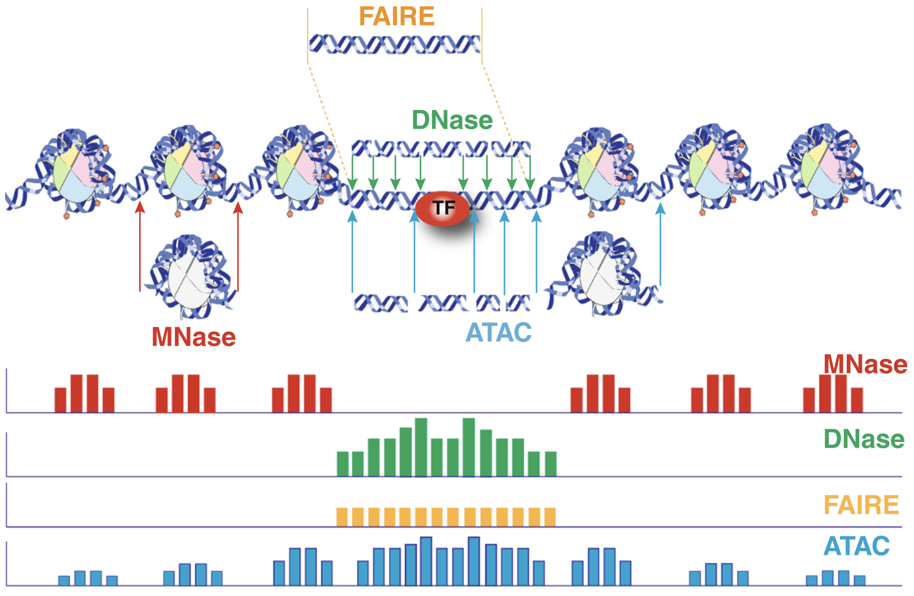

```{r include=FALSE}
library(knitr)
library(BiocStyle)
opts_chunk$set(cache=TRUE, message=FALSE, warning=FALSE)
```

# Background

Chromatin accessibility assays measure the extent to which DNA is open and accessible.
Such assays now use high throughput sequencing as a quantitative readout. DNAse assays, first using microarrays[@Crawford2006-nt] and then DNAse-Seq [@Crawford2006-bk], requires a larger amount of DNA and is labor-indensive and has been largely supplanted by ATAC-Seq [@Buenrostro2013-dz]. 

The Assay for Transposase Accessible Chromatin with high-throughput sequencing (ATAC-seq) method maps chromatin accessibility genome-wide. This method quantifies DNA accessibility with a hyperactive Tn5 transposase that cuts and inserts sequencing adapters into regions of chromatin that are accessible. High throughput sequencing of fragments produced by the process map to regions of increased accessibility, transcription factor binding sites, and nucleosome positioning. The method is both fast and sensitive and can be used as a replacement for DNAse _and_ MNase. A schematic of the protocol is given in Figure \@ref(fig:protocol).

```{r protocol, echo=FALSE, fig.cap = "Schematic overview of ATAC-Seq protocol. Figure from Wikipedia."}
knitr::include_graphics("https://upload.wikimedia.org/wikipedia/commons/thumb/d/d9/ATAC-Seq_Fig.1.pdf/page1-984px-ATAC-Seq_Fig.1.pdf.jpg")
```

An early review of chromatin accessibility assays [@Tsompana2014-yh] compares the use cases, pros and cons, and expected signals from each of the most common approaches (Figure \@ref(fig:chromatinAssays)).

```{r chromatinAssays, echo=FALSE, fig.cap="Chromatin accessibility methods, compared. Representative DNA fragments generated by each assay are shown, with end locations within chromatin defined by colored arrows. Bar diagrams represent data signal obtained from each assay across the entire region. The footprint created by a transcription factor (TF) is shown for ATAC-seq and DNase-seq experiments."}

```

The first manuscript describing ATAC-Seq protocol and findings outlined how ATAC-Seq data "line up" with other datatypes such as ChIP-seq and DNAse-seq (Figure \@ref(fig:greenleaf)). They also highlight how fragment length correlates with specific genomic regions and characteristics [@Buenrostro2013-dz, Figure 3].

```{r greenleaf, echo=FALSE, fig.cap='Multimodal chromatin comparisons. From [@Buenrostro2013-dz], Figure 4. (a) CTCF footprints observed in ATAC-seq and DNase-seq data, at a specific locus on chr1. (b) Aggregate ATAC-seq footprint for CTCF (motif shown) generated over binding sites within the genome (c) CTCF predicted binding probability inferred from ATAC-seq data, position weight matrix (PWM) scores for the CTCF motif, and evolutionary conservation (PhyloP). Right-most column is the CTCF ChIP-seq data (ENCODE) for this GM12878 cell line, demonstrating high concordance with predicted binding probability.'}
knitr::include_graphics("imgs/greenleaf_chip_dnase_atac.png")
```

Buenrostro et al. provide a detailed protocol for performing ATAC-Seq and quality control of results [@Buenrostro2015-dz]. Updated and modified protocols that improve on signal-to-noise and reduce input DNA requirements have been described.

## Informatics overview

ATAC-Seq protocols typically utilize paired-end sequencing protocols. The reads are aligned to the respective _genome_ using `bowtie2`, `BWA`, or other short-read aligner. The result, after appropriate manipulation, often using `samtools`, results in a BAM file. Among other details, the BAM format includes columns for:

- sequence name (`chr1`)
- start position (integer)
- a _CIGAR_ string that describes the alignment in a compact form
- the sequence to which the pair aligns
- the position to which the pair aligns
- a bit flag field that describes multiple characteristics of the alignment
- the sequence and quality string of the read
- additional tags that tend to be aligner-specific

Duplicate fragments (those with the *same* start and end position of other reads) are marked and likely discarded. Reads that fail to align "properly" are also often excluded from analysis. It is worth noting that most software packages allow simple "marking" of such reads and that there is usually no need to create a special BAM file before proceeding with downstream work. 

After alignment and BAM processing, the workflow can switch to _Bioconductor_. 

## Working with aligned reads

The _Bioconductor_ project includes several infrastructure packages for dealing with ranges (sequence name, start, end, +/- strand) on sequences [@Lawrence2013-he]. 

The `r Biocpkg('GenomicRanges')` package .


# Data import and quality control


```{r message=FALSE}
library(GenomicAlignments)
```

- ScanBamParam


```{r readGreenleaf}
greenleaf = readGAlignmentPairs(
  system.file(package='AtacSeqWorkshop',
              'extdata/Sorted_ATAC_21_22.bam'),
  param = ScanBamParam(
    mapqFilter = 1, 
    flag = scanBamFlag(
      isPaired = TRUE, 
      isProperPair = TRUE), 
    what = c("mapq", "isize")))
```


```{r}
library(ggplot2)
library(dplyr)
chromCounts = table(seqnames(greenleaf)) %>% 
  data.frame() %>%
  dplyr::rename(chromosome=Var1, count = Freq)
```


```{r plotChromCounts, fig.cap="Reads per chromosome. In our example data, we are using only chromosomes 21 and 22."}
ggplot(chromCounts, aes(x=chromosome, y=count)) + 
  geom_bar(stat='identity') +
  theme(axis.text.x = element_text(angle = 45, hjust = 1))
```

```{r chromReadProps}
chromCounts = chromCounts %>%
  dplyr::mutate(readsPerMb = (count/(seqlengths(gl)/1e6)))
```

```{r plotReadProps, fig.cap = "Read counts normalized by chromosome length. This is not a particularly important plot, but it can be useful to see the relative contribution of each chromosome given its length."}
ggplot(chromCounts, aes(x=chromosome, y=readsPerMb)) + 
  geom_bar(stat='identity') +
  theme(axis.text.x = element_text(angle = 45, hjust = 1)) + 
  theme_bw()
```

## Coverage

Histogram of coverage.

```{r}
cvg = coverage(gl)
plotCvgHist = function(cvg, chromosome) {
  library(ggplot2)
  cvgcounts = as.data.frame(table(cvg[[chromosome]]))
  cvgcounts[,1] = as.numeric(as.character(cvgcounts[,1]))
  colnames(cvgcounts) = c('Coverage', 'Count')
  ggplot(cvgcounts, aes(x=Coverage, y=Count)) + 
    ggtitle(paste("Chromosome",chromosome)) + 
    geom_point(alpha=0.5) + 
    geom_smooth(span=0.2) + 
    scale_y_log10() +
    theme_bw() 
}
for(i in c('chr21', 'chr22')) {
  print(plotCvgHist(cvg, i))
}
```

## Fragment Lengths

```{r}
gl_nf = gl[mcols(first(gl))$isize<100]
```


```{r eval = FALSE}
dat = readGAlignmentPairs(system.file(package='AtacSeqWorkshop', 'extdata/ENCFF768UMR.bam'),
                          param = ScanBamParam(mapqFilter = 1, 
    flag = scanBamFlag(isPaired = TRUE, isProperPair = TRUE), what = c("mapq", "isize")))
dat = readGAlignmentPairs('../inst/extdata/Sorted_ATAC_50K_2.bam',
                          param = ScanBamParam(mapqFilter = 1, 
    flag = scanBamFlag(isPaired = TRUE, isProperPair = TRUE), what = c("mapq", "isize")))

insertSizes = abs(mcols(GenomicAlignments::first(gl1))$isize)
library(dplyr)
library(ggplot2)
fragLenPlot <- table(insertSizes) %>% data.frame %>% rename(InsertSize = insertSizes, 
    Count = Freq) %>% mutate(InsertSize = as.numeric(as.vector(InsertSize)), 
    Count = as.numeric(as.vector(Count))) %>% ggplot(aes(x = InsertSize, y = Count)) + 
    geom_line()
print(fragLenPlot + theme_bw() + lims(x=c(-1,250)))
```


# Viewing data in IGV

```{r exportBW}
library(rtracklayer)
export.bw(coverage(gl),'greenleaf.bw')
```

```{r}
dat3 = readGAlignmentPairs('~/Downloads/ATAC_Workshop/ATAC_Data/ATAC_BAM_forCounting/Sorted_Hindbrain_day_12_1_Small_Paired.bam',
                          param = ScanBamParam(mapqFilter = 1, 
    flag = scanBamFlag(isPaired = TRUE, isProperPair = TRUE), what = c("mapq", "isize")))
```

# Getting started

To enable the _Bioconductor_ style in your R Markdown vignette you need to include the following in the `DESCRIPTION` file:

    VignetteBuilder: knitr
    Suggests: BiocStyle, knitr, rmarkdown


# Style macros

_BiocStyle_ introduces the following macros for referring to _R_ packages:

* `r Biocpkg("IRanges")`, for _Bioconductor_ software, annotation and experiment data packages,
* `r CRANpkg("data.table")`, for _R_ packages available on CRAN,
* `r Githubpkg("rstudio/rmarkdown")`, for _R_ packages available on GitHub,
* `r Rpackage("MyPkg")`, for _R_ packages that are _not_ available on _Bioconductor_, CRAN or GitHub.


# Figures

Assign captions to figures in the code chunk option `fig.cap` to automatically number them, and to be able to reference them, see Figure \@ref(fig:plot). The figure label is generated from the code chunk label by prefixing it with `fig:`.

```{r plot, fig.cap="Regular figure. The first sentence of the figure caption is automatically emphasized to serve as figure title.", echo=FALSE}
plot(cars)
```

Small and wide figures can be specified by `fig.small` and `fig.wide` code chunk options.

```{r small, fig.cap="Small figure. A plot produced by a code chunk with option `fig.small = TRUE`.", fig.small=TRUE, echo=FALSE}
plot(cars)
```

```{r wide, fig.cap="Wide figure. A plot produced by a code chunk with option `fig.wide = TRUE`.", fig.wide=TRUE, echo=FALSE}
plot(cars)
```


# Equations

To number and reference equations, put them in equation environments and assign labels to them, see Equation \@ref(eq:binom).

\begin{equation}
  f\left(k\right) = \binom{n}{k} p^k\left(1-p\right)^{n-k}
  (\#eq:binom)
\end{equation}


# Tables

Like figures, tables with captions will also be numbered and can be referenced, see Table \@ref(tab:table).

Fruit   | Price
------- | -----
bananas | 1.2
apples  | 1.0
oranges | 2.5

: (\#tab:table) A simple table. With caption.


# Cross-references

Apart from referencing figures (Section \@ref(figures)), tables (Section \@ref(tables)), and equations (Section \@ref(equations)), you can also use the same syntax to refer to sections by their default labels generated by pandoc.


# Side notes

Footnotes are displayed as side notes on the right margin^[this is a side note entered as a footnote], which has the advantage that they appear close to the place where they are defined.


# Session info {.unnumbered}

```{r sessionInfo, echo=FALSE}
sessionInfo()
```

# Appendix {.unnumbered}

## IGV

Download IGV for Mac, Windows, or Linux from [here]().


## MACS2

The MACS2 package is a commonly-used package for calling peaks. Installation
and other details are available[^macs].

[^macs]: https://github.com/taoliu/MACS

```
pip install macs2
```

# References
